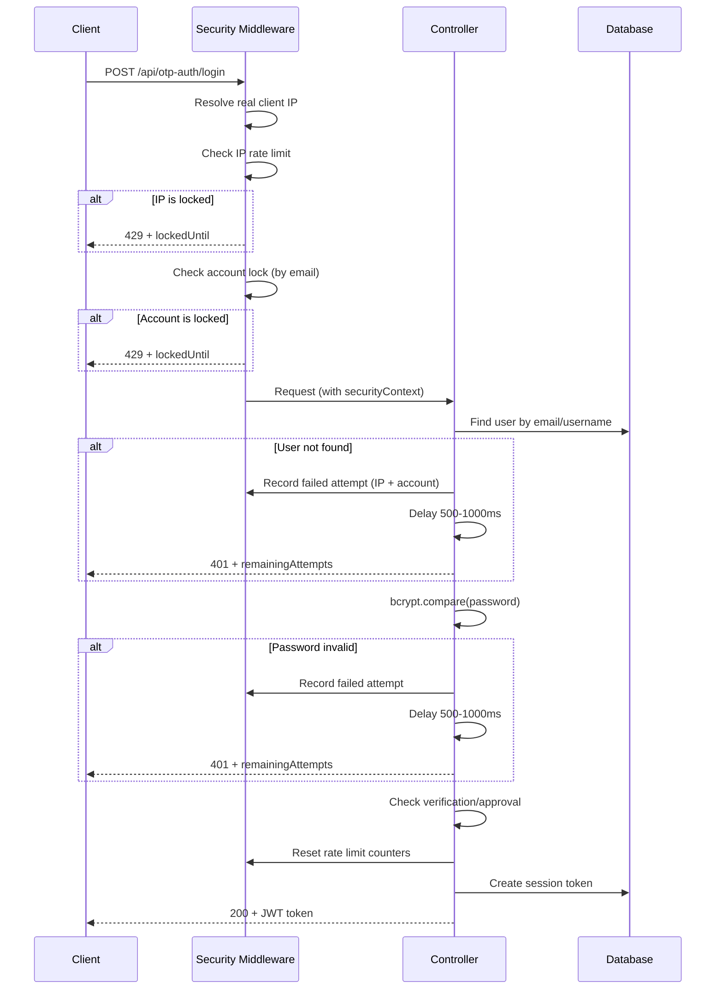
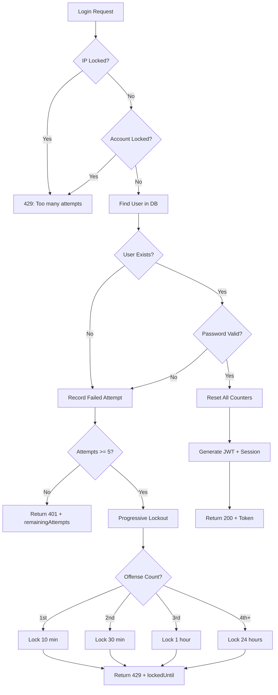
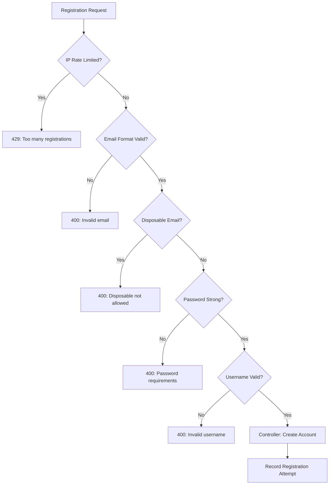
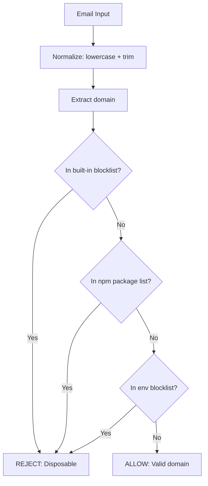

# Authentication Security Documentation

## Overview

Enterprise-grade authentication security for the Allure platform, protecting login and registration endpoints against brute-force attacks, spam registrations, bots, and disposable email addresses.

## Architecture

```
backend/
├── src/
│   ├── config/
│   │   ├── security.config.js          # Centralized security configuration
│   │   ├── helmet.config.js            # HTTP security headers
│   │   └── db.js
│   ├── controllers/
│   │   ├── authController.js           # Legacy login (enhanced)
│   │   └── otpAuthController.js        # OTP login + register (enhanced)
│   ├── middleware/
│   │   ├── authSecurity.js             # Login + registration security middleware
│   │   ├── rateLimiter.js              # General rate limiters (OTP, admin)
│   │   └── authMiddleware.js           # JWT verification
│   ├── services/
│   │   └── security/
│   │       ├── memoryStore.js          # In-memory TTL key-value store
│   │       ├── storeFactory.js         # Redis/Memory store factory
│   │       ├── loginRateLimiter.js     # IP-based login rate limiting
│   │       ├── accountLockService.js   # Account-level lock
│   │       ├── registrationRateLimiter.js # Registration rate limiting
│   │       ├── disposableEmailChecker.js  # Disposable email detection
│   │       ├── authValidator.js        # Password/username validation
│   │       └── securityLogger.js       # Security event logging
│   └── utils/
│       ├── ipResolver.js              # Proxy-aware IP resolution
│       └── logger.js                  # Winston logger
├── tests/
│   └── auth-security.test.js          # Comprehensive test suite
└── SECURITY.md                        # This document
```

## Authentication Flow



## Login Rate Limiter Flow



## Registration Security Flow



## Disposable Email Validation Flow



## Security Design Decisions

### 1. Pre-controller Security Checks
All rate limiting and lock checks execute BEFORE database queries, password hashing, and JWT generation. This minimizes resource consumption from abusive requests.

### 2. Generic Error Messages
The system never reveals whether an email exists in the database. Both "user not found" and "wrong password" return the same message: `"Invalid email/username or password"`.

### 3. Dual-Layer Rate Limiting
- **IP-based**: Prevents a single IP from overwhelming the server
- **Account-based**: Prevents distributed attacks from multiple IPs targeting the same account

### 4. Progressive Lockout
Repeat offenders face escalating lock durations (10min → 30min → 1hr → 24hr), making sustained attacks impractical.

### 5. Response Delay
Failed login responses include a 500-1000ms delay with random jitter to slow automated attacks and prevent timing-based user enumeration.

### 6. Server-Driven Countdown
The frontend never calculates lock durations. Instead, the server provides `lockedUntil` (ISO timestamp), and the client calculates the countdown from it. This prevents client-side tampering.

### 7. In-Memory Store with Redis Readiness
Security data is stored in an in-memory Map with automatic TTL cleanup. The `storeFactory` is designed so adding Redis requires only setting `REDIS_URL` and implementing the Redis adapter — no changes to business logic.

### 8. Disposable Email Detection
Uses a comprehensive approach:
- Built-in blocklist of ~400+ known domains
- `disposable-email-domains` npm package (~3,000+ domains)
- Environment-variable-configurable additions

## Environment Variables

| Variable | Default | Description |
|----------|---------|-------------|
| `LOGIN_MAX_ATTEMPTS` | `5` | Max failed login attempts before lockout |
| `LOGIN_WINDOW_MINUTES` | `10` | Rolling window for login attempt tracking |
| `LOGIN_DELAY_MS` | `750` | Base delay on failed login (ms) |
| `REGISTER_MAX_ATTEMPTS` | `3` | Max registrations per IP per window |
| `REGISTER_WINDOW_MINUTES` | `30` | Registration rate limit window |
| `ACCOUNT_LOCK_MINUTES` | `15` | Account lock duration |
| `ACCOUNT_LOCK_MAX_ATTEMPTS` | `5` | Failed attempts before account lock |
| `PROGRESSIVE_LOCKOUT_MINUTES` | `10,30,60,1440` | Escalating lock durations (comma-separated) |
| `IP_BLOCK_THRESHOLD` | `100` | Global IP block threshold |
| `IP_BLOCK_WINDOW_MINUTES` | `60` | Global IP block window |
| `REDIS_URL` | *(empty)* | Redis connection URL (optional) |
| `ADDITIONAL_BLOCKED_DOMAINS` | *(empty)* | Extra disposable email domains (comma-separated) |

## Setup Guide

### 1. Install Dependencies
```bash
cd backend
npm install
```

### 2. Configure Environment
Add security variables to `.env` (see table above). Defaults are production-safe.

### 3. Run Tests
```bash
node --test tests/auth-security.test.js
```

### 4. Start Server
```bash
npm run dev    # development
npm start      # production
```

## Adding New Blocked Email Providers

### Option 1: Environment Variable (no code change)
```env
ADDITIONAL_BLOCKED_DOMAINS=newdisposable.com,anotherfake.net
```

### Option 2: Add to Built-in List
Edit `src/services/security/disposableEmailChecker.js` and add domains to the `BUILTIN_DOMAINS` Set:
```js
const BUILTIN_DOMAINS = new Set([
  // ... existing domains
  'newdisposable.com',
]);
```

### Option 3: npm Package Updates
The `disposable-email-domains` package is regularly updated. Run:
```bash
npm update disposable-email-domains
```

## Redis Integration Guide

When you need Redis (for multi-instance deployments):

1. Set `REDIS_URL` in your environment:
   ```env
   REDIS_URL=redis://localhost:6379
   ```

2. Install a Redis client:
   ```bash
   npm install ioredis
   ```

3. Create `src/services/security/redisStore.js` implementing the same interface as `memoryStore.js`:
   - `get(key)` → `redis.get(key)` + JSON.parse
   - `set(key, value, ttlMs)` → `redis.set(key, JSON.stringify(value), 'PX', ttlMs)`
   - `increment(key, ttlMs)` → `redis.incr(key)` + `redis.pexpire(key, ttlMs)`
   - `delete(key)` → `redis.del(key)`

4. Update `storeFactory.js` to use `RedisStore` when `REDIS_URL` is available.

No other code changes are needed — all security services use the store through the factory.
